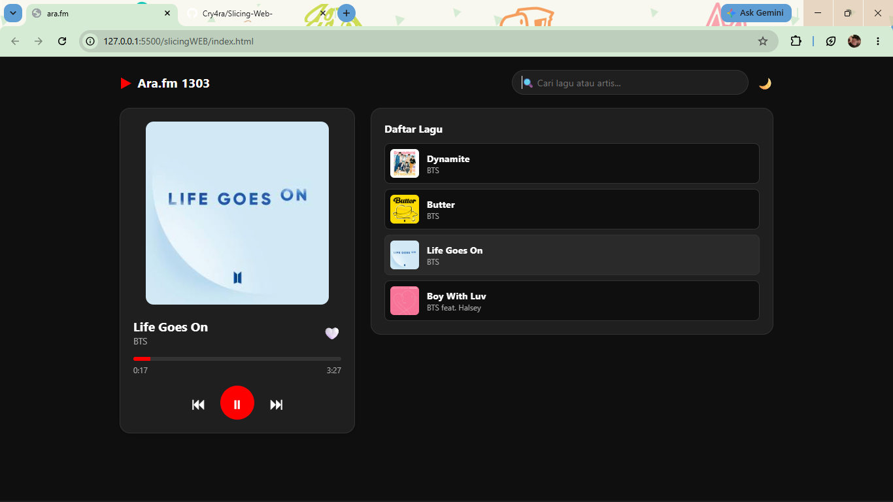

.main-content dibagi menjadi dua bagian utama, yaitu kartu pemutar musik <main> yang menampilkan foto sampul, rincian lagu, tombol suka, progress bar, dan kontrol navigasi pemutaran, serta seksi daftar lagu <section> yang memuat wadah kosong #songList untuk diisi komponen lagu secara dinamis dari JavaScript. Di bagian paling atas, kode mereset margin dan padding bawaan browser serta menyiapkan variabel warna seperti bg-color dan card-bg pada class .dark-mode dan .light-mode untuk mempermudah fitur ganti tema secara otomatis. Struktur dasarnya memanfaatkan Flexbox untuk meratakan tata letak body, .navbar, kartu pemutar musik .player-card, hingga daftar lagu .song-item agar posisinya sejajar dan simetris. Pada elemen visual seperti gambar album dan tombol play, dibuat sudut membulat (border-radius) serta efek warna saat diarahkan kursor (hover) atau lagu sedang aktif (active). Terakhir, @media (min-width: 768px) fungsinya untuk responsivitas, jadi tampilan satu kolom bertumpuk yang pas di layar HP akan otomatis berubah menjadi tata letak CSS Grid dua kolom berdampingan saat dibuka di laptop. daftar lagu beserta detail judul, penyanyi, sampul, dan durasinya disimpan dalam array of objects playlist, yang kemudian dihubungkan ke elemen HTML menggunakan document.getElementById(). loadSong() fungsinta memperbarui data lagu aktif di layar, lalu renderPlaylist() membuat daftar lagu secara otomatis menggunakan perulangan .forEach() dan menambahkan penanda kelas active pada lagu yang sedang diputar.
